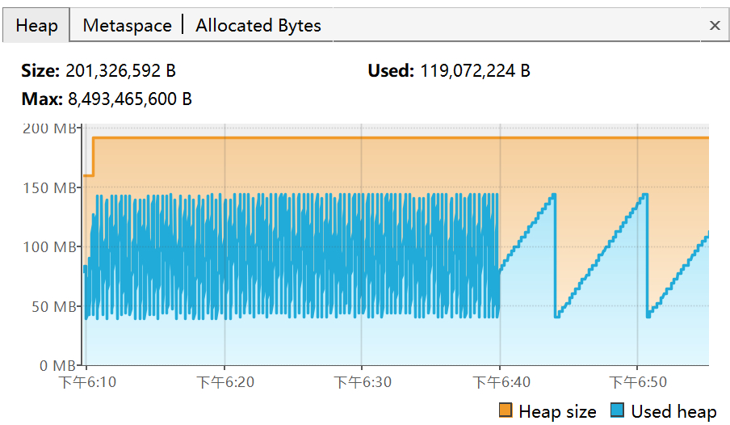
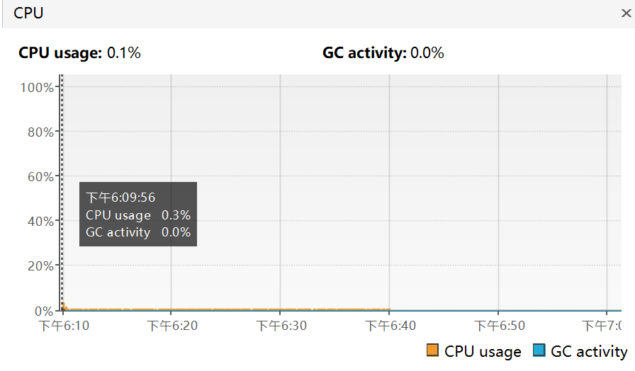

# P1 全量验收清单

## 1. 文档用途

本清单用于确认个人技术博客系统 P1 功能是否达到可交付状态，并为后续生产式部署演练和正式上线保留可核对的验收记录。

本清单不是自动化测试用例的替代品。自动化测试负责稳定、可重复地验证代码行为；人工验收负责验证跨页面流程、真实浏览器交互、视觉响应式、外部服务和部署环境。

### 1.1 勾选规则

- `[ ]`：尚未执行、执行失败，或缺少证据。
- `[x]`：已经在本次记录的环境中执行，并且实际结果符合预期。
- 不适用的项目不要直接勾选，在项目后标注 `[N/A]` 并写明原因。
- 被阻塞的项目保持未勾选，在项目后标注 `[BLOCKED: 缺陷编号或原因]`。
- 修复缺陷后必须重新执行受影响项目，不能仅凭代码修改将项目改为已通过。

清单可以在验收过程中持续更新并提交。勾选结果代表某个确定版本和环境，代码、配置或部署环境发生实质变化后，受影响项目需要重新验收。

### 1.2 验收记录

| 项目                  | 记录                                                         |
| --------------------- | ------------------------------------------------------------ |
| 验收版本 / Commit SHA | eba0c9b05c86dae5ea6d599163113192ac0eeb0f                     |
| 验收分支              | `develop`                                                    |
| 验收开始时间          | 2026-09-16                                                   |
| 验收完成时间          |                                                              |
| 验收负责人            | sanjuu                                                       |
| 前端地址              | http://localhost:5173                                        |
| 后端地址              | http://localhost:8080                                        |
| 数据库环境            | PostgreSQL 16.13，Compose 服务 `postgres`，localhost:5432/blog_db |
| Redis 环境            | Redis 7.4，localhost:6379/0                                  |
| 浏览器及版本          | Edge v153.0.4234.32；Chrome v153.0.8010.48                   |
| 操作系统 / 设备       | Windows 11                                                   |
| 关联 CI 运行地址      | [CI #33](https://github.com/sanjuu2024/blog/actions/runs/35721516369) |
| 最终结论              | 进行中                                                       |

### 1.3 缺陷记录

| 编号   | 严重级别 | 模块         | 现象与复现步骤                                               | 处理结果         | 复测结果         |
| ------ | -------- | ------------ | ------------------------------------------------------------ | ---------------- | ---------------- |
| P1-001 | Minor    | 后台用户管理 | 发现版本 `6c58e507a7a8f68e586828e630413dd7bda2de2e` 存在问题：<br />用户名和邮箱筛选使用大小写敏感匹配，与登录、查重规则不一致。<br />输入 `HEFA` 无法匹配已注册用户名 `hefa`。 | 处理结果：已改为不区分大小写的字面量包含查询。<br />修复版本：`0053d4e4932b22747129186f0593a8b00c16f8e1`。 | 复测结果：已复测。 |
| P1-002 | Major | 前台用户公开资料 | 发现版本 `0053d4e4932b22747129186f0593a8b00c16f8e1` 存在问题：<br />缺少公开资料的前端展示入口，与文档要求不一致。 | 处理结果：已新增用户公开资料展示组件。<br />修复版本：`064f36065f1986c609cb0de64b6fb142aa8b4ac2`。 | 复测结果：已复测。 |
| P1-003 | Minor | 后台分类管理 | 发现版本 `064f36065f1986c609cb0de64b6fb142aa8b4ac2` 存在问题：<br />后台分类管理筛选条件为 `禁用` 时，仅筛选出了禁用的一级分类，未显示被单独禁用的二级分类。 | 处理结果：已改为任一筛选条件返回平铺列表。<br />修复版本：`b27735e3df1b783281effd37860bf3ec5edcf746`。 | 复测结果：已复测。 |

严重级别约定：

- `Blocker`：系统无法启动、数据损坏、核心流程完全不可用或存在严重安全问题，必须停止验收。
- `Critical`：注册登录、文章发布、公开浏览等核心流程错误，P1 不能通过。
- `Major`：重要功能错误但存在绕行方式，原则上修复后才能通过。
- `Minor`：不影响核心流程的视觉、文案或低频交互问题，可评估后进入后续迭代。

## 2. 验收范围与退出标准

P1 验收范围以 [PRD.md](./PRD.md)、[database-design.md](./database-design.md)、[api-design.md](./api-design.md)、[openapi.yaml](./openapi.yaml) 和 [frontend-design.md](./frontend-design.md) 为准。

### 2.1 P1 退出标准

- [ ] 本清单中的必测项目全部通过，或已按规则标记为 `[N/A]`。
- [ ] GitHub Actions 前端、后端 Job 全部通过。

- [ ] 不存在未解决的 `Blocker`、`Critical` 缺陷。
- [ ] 核心业务不存在未解决的 `Major` 缺陷；非核心 `Major` 缺陷有明确处理结论、负责人和计划时间。
- [ ] 空数据库迁移和历史数据库升级演练均通过。
- [ ] 真实 OSS 与真实 SMTP 各完成至少一次外部服务验收。
- [ ] 本机 Linux / WSL 生产式部署演练通过。
- [ ] 代码、数据库、接口与产品文档保持一致。

真实公网服务器部署不是“P1 功能完成”的硬性条件，但属于正式上线前的硬性条件。若 P1 结束后暂不正式上线，可以先完成本机生产式部署演练，将真实服务器部署留到上线准备阶段。

## 3. 验收准备

### 3.1 代码与环境

- [x] `develop` 已同步远端最新提交，工作区不存在来源不明的改动。
- [x] 已记录本次验收 Commit SHA，后续结果均对应这一版本。
- [x] 前端使用生产构建或明确记录的开发构建，后端使用对应同一 Commit 的代码。
- [x] PostgreSQL、Redis 状态正常，测试库与日常开发库相互隔离。
    -   人工验收：Compose 服务 `postgres` + 服务 `redis`，Redis DB 0。
      - 自动化测试：`blog_test` + Redis DB 1。
- [x] 测试环境所需变量已经注入，密码、JWT、OSS、SMTP 凭据没有提交到 Git。
- [x] 已准备管理员、普通用户、禁用用户和游客场景。
- [x] 已准备至少一篇草稿文章、一篇已发布文章和一篇已下线文章。
- [x] 已准备一级、二级分类以及多个标签。
- [x] 开始破坏性或迁移测试前已经备份当前数据库。

### 3.2 建议测试数据

- [x] 管理员账号可以登录后台。
- [x] 至少两个普通用户账号可用于评论可见性和权限隔离测试。
- [x] 至少一个禁用账号可用于登录与 Token 失效测试。
- [x] 至少一篇允许评论和一篇关闭评论的已发布文章。
- [x] 至少一组多级评论树和一组包含多条管理员回复的留言。
- [x] 准备合法的 JPG、JPEG、PNG、WebP、GIF 文件，以及非法 SVG、伪造扩展名、超限文件。
- [x] 准备一个仅用于验收收信的邮箱，避免向无关人员发送通知。

## 4. 自动化质量门禁

- [x] GitHub Actions `Frontend` Job 通过。
- [x] GitHub Actions `Backend` Job 通过。
- [x] 前端 ESLint、Stylelint、Prettier 检查通过。
- [x] 前端全量 Vitest 通过。
- [x] 前端生产构建通过。
- [x] 后端 `mvn clean verify` 通过。
- [x] 后端单元测试与 Spring 集成测试全部通过；跳过项已确认原因。
    - [x] 跳过项为 `PasswordHashGenerationTest` 的 `shouldGenerateBcryptHashForSeedPassword()` 函数，该测试函数仅供手动运行，用于为种子帐户生成 BCrypt 哈希密码。

- [x] JaCoCo HTML/XML 报告正常生成并上传为 CI Artifact。
- [x] JaCoCo 行覆盖率和分支覆盖率达到项目当前门槛。
- [x] GreenMail SMTP 集成测试通过，邮件未离开测试进程。
- [x] CI 日志、测试报告和构建产物中不存在真实密钥或敏感数据。

执行记录：

| 检查   | 命令或 CI 地址                                               | 结果          | 时间             |
| ------ | ------------------------------------------------------------ | ------------- | ---------------- |
| 前端   | `pnpm lint && pnpm test:run && pnpm build`                   | BUILD SUCCESS | 2026-09-16 16:49 |
| 后端   | `mvn clean verify`                                           | BUILD SUCCESS | 2026-09-16 17:47 |
| JaCoCo | `./mvnw.cmd clean verify` 之后查看 `backend/target/site/jacoco/index.html` | PASS          | 2026-09-16 17:50 |

## 5. 验收前冒烟测试

冒烟测试是一组固定、可重复的核心流程检查，可以人工执行，也可以逐步自动化。当前没有端到端测试框架时允许人工执行，但必须按以下步骤记录结果；任一 `Blocker` 或 `Critical` 项失败时停止全量验收，先修复环境或核心功能。

- [x] 前端首页可以打开，静态资源、主题和主导航正常。
- [x] 后端可以启动，Flyway、PostgreSQL、Redis 初始化无错误。
- [x] 游客可以打开文章列表和一篇已发布文章详情。
- [x] 新用户可以注册、登录、刷新页面后保持登录状态并退出。
- [x] 管理员可以进入后台，用户、文章、分类、标签页面可打开。
- [x] 管理员可以创建草稿、发布文章，前台可以看到该文章。
- [x] 登录用户可以发表评论，管理员可以在后台审核，前台可以看到审核结果。
- [x] 游客可以发表留言，管理员可以审核并回复。
- [x] 上传一张测试图片后，返回的 OSS URL 可以公开访问。
- [x] 订阅留言回复通知后，管理员回复可以向验收邮箱发送邮件。

## 6. 身份认证与用户

### 6.1 注册和登录

- [x] 合法用户名、邮箱、密码可以注册，注册后可以登录。
- [x] 用户名和邮箱唯一性按大小写不敏感处理。
- [x] 用户名、邮箱、密码为空、格式错误或长度越界时，前后端均阻止提交并显示明确提示。
- [x] 重复用户名返回用户名已存在，重复邮箱返回邮箱已存在。
- [x] 用户名和邮箱两种方式均可登录，大小写差异不影响账号匹配。
- [x] 错误密码、未知账号和禁用账号无法登录，错误信息不泄露密码或敏感细节。
- [x] 登录、注册表单按 Enter 与点击提交按钮行为一致，无效表单不会发送请求。

### 6.2 Token 与会话

- [x] 登录成功后 Access Token 可访问受保护接口，Refresh Token 写入 HttpOnly Cookie。
- [x] Access Token 到期后，前端可以通过 Refresh Token 恢复登录态。
- [x] 刷新成功后旧 Refresh Token 失效，新 Refresh Token 生效。
- [x] Refresh Token 缺失、伪造、过期、撤销时，刷新失败并清理前端登录态。
- [x] 退出登录后 Refresh Token 会话失效；重复退出仍返回成功。
- [x] 修改密码后，旧 Access Token 和全部活跃 Refresh Token 失效。
- [x] 管理员禁用用户后，该用户旧 Access Token 和 Refresh Token 均失效。
- [x] 管理员修改用户角色后，旧 Access Token 失效；刷新或重新登录后取得新角色。
- [x] Redis 缓存缺失时 tokenVersion 可以回源数据库；Redis 数据不作为持久化权威来源。

### 6.3 个人资料与后台用户管理

- [x] 用户可以查看公开资料和自己的完整资料，公开资料不返回邮箱等私有字段。
- [x] 用户可以独立修改昵称、简介，未提交的字段保持原值。
- [x] 用户名不可修改。
- [x] 用户可以上传头像，刷新后仍显示新头像。
- [x] 管理员可以按用户名、邮箱、角色、状态组合筛选用户。
- [x] 管理员不能修改自己的角色或状态。
- [x] 用户列表、个人资料和安全操作不存在越权访问。

## 7. 文章、分类、标签与搜索

### 7.1 后台文章生命周期

- [x] 管理员可以创建草稿，草稿不会出现在前台。
- [x] 创建或更新文章时必须绑定二级分类，一级分类不能直接绑定。
- [x] Markdown 正文保存后，数据库中的 `content_md`、`content_html`、`content_text` 均正确更新。
- [x] 草稿可以发布；已发布文章可以下线；已下线文章可以重新发布。
- [x] 已发布过的文章不能回退为草稿，首次发布时间不会因更新、下线或重新发布而改变。
- [x] 置顶文章优先展示，多篇置顶文章按发布时间倒序。
- [x] 标签、摘要、封面、是否允许评论等字段可以保存和回显。
- [x] 编辑内容后离开页面会提示未保存；保存成功后离开不重复提示。
- [x] 删除或下线文章后，前台可见性与接口响应符合设计。

### 7.2 分类与标签

- [x] 分类只允许两级；二级分类必须绑定存在的一级分类。
- [x] 一级分类名称全局唯一，二级分类名称在同一父分类下唯一，比较不区分大小写。
- [x] 更新分类时不能修改层级。
- [x] 一级分类存在子分类时不能删除，二级分类存在文章时不能删除。
- [x] 分类树、关键字筛选、层级筛选、父分类筛选和文章计数正确。
- [x] 标签可以创建、编辑、删除，同名约束和文章关联行为符合设计。
- [x] 前台只展示启用的分类和标签；文章所属二级分类及父分类禁用后，文章不可公开访问。

### 7.3 公开浏览与搜索

- [x] 游客只能浏览已发布文章，草稿和下线文章不可见。
- [x] 文章列表、文章详情中的作者、分类、标签、摘要、统计信息正确。
- [x] 关键词同时检索标题、摘要和正文纯文本，多个检索词使用 AND 关系。
- [x] 搜索结果标题和摘要/正文命中位置高亮，未命中摘要时使用正文片段。
- [x] 搜索可以与分类、标签筛选组合，URL query 可以刷新、分享和前进后退恢复。
- [x] 搜索显示命中总数，无结果时显示明确空状态。
- [x] 分类页一级、二级分类切换和文章结果正确，移动布局下分类列表可展开和关闭。
- [x] 文章目录高亮、跳转和关闭行为正常，代码块语法高亮正常。

## 8. 评论

### 8.1 前台评论

- [ ] 游客不能发表评论，登录后可以发表评论和回复。
- [ ] 普通用户评论初始为待审核，管理员评论直接通过。
- [ ] 登录用户可以看到自己的待审核或已拒绝评论，其他用户和游客不可见。
- [ ] 携带失效 Token 请求评论列表时返回认证错误，不静默降级为游客。
- [ ] 文章关闭评论后不能新增评论或回复，但已有评论仍可查看，作者仍可删除自己的评论。
- [ ] 回复插入当前目标评论下方，回复目标、根评论关系和多级展示正确。
- [ ] 加载更多回复不会与本地新插入回复重复，剩余数量文案正确。
- [ ] 长评论可以展开、收起，切换后定位到整条评论，回复、删除和展开操作位于同一底部工具栏。
- [ ] 用户可以逻辑删除自己的评论，不能删除其他用户评论。
- [ ] 同一用户对同一文章的评论限流生效，限流窗口结束后可以再次提交。

### 8.2 后台评论管理

- [ ] 管理员可以按文章、用户、状态、层级和创建时间筛选评论。
- [ ] 评论状态按 `PENDING`、`APPROVED`、`REJECTED`、`HIDDEN`、`DELETED` 的规则流转。
- [ ] 拒绝、隐藏、删除必须填写处理原因；通过时清空旧原因。
- [ ] 管理员可以隐藏或删除自己的评论，管理员自己的新评论直接通过。
- [ ] 删除顶层评论或回复时，规定的子树逻辑删除和审核字段保留规则正确。
- [ ] 审核、隐藏、删除与文章 `comment_count` 在同一事务中保持一致。
- [ ] 批量通过只处理合法待审核评论，任一目标不合法时整批失败。
- [ ] 已拒绝、已隐藏、已删除行使用 muted 视觉，已拒绝状态标签保持红色。

## 9. 留言与邮件通知

### 9.1 前台留言

- [ ] 游客可以填写昵称和留言；邮箱可选，勾选通知时邮箱必填且格式合法。
- [ ] 登录用户使用账号资料，可以选择使用账号邮箱接收通知。
- [ ] 普通用户和游客留言初始为待审核，管理员留言直接通过。
- [ ] 登录用户可以看到自己的待审核或已拒绝留言，游客刷新后不能找回未审核留言。
- [ ] 携带失效 Token 请求留言列表时返回认证错误，不静默降级为游客。
- [ ] 游客和登录用户的 30 秒、每小时限流均生效。
- [ ] 用户只能逻辑删除自己的顶层留言，删除顶层留言时管理员回复一并逻辑删除。
- [ ] 长留言可以展开、收起，底部工具栏吸附和整条留言定位正常。
- [ ] 移动端留言编辑器默认折叠，展开后表单校验、提交和收起正常。

### 9.2 后台留言管理

- [ ] 管理员可以按留言 ID、用户 ID、游客昵称、游客邮箱、内容、状态、层级和创建时间筛选。
- [ ] 管理员可以通过、拒绝、隐藏、删除留言，处理原因和状态规则正确。
- [ ] 管理员只能回复已通过的顶层留言，可以对同一留言多次回复。
- [ ] 管理员回复直接通过，公共页面不向普通用户提供回复入口。
- [ ] 批量通过最多处理 100 条待审核顶层留言，任一目标不合法时整批失败。

### 9.3 邮件通知与退订

- [ ] GreenMail 集成测试验证事务提交后通过 SMTP 发送、纯文本内容和不发送分支。
- [ ] 使用真实 SMTP 测试账号发送一封通知，验收邮箱实际收到邮件。
- [ ] 邮件发件人、收件人、主题、留言摘要、回复内容、查看链接和退订链接正确。
- [ ] 未勾选通知、邮箱为空或已经退订时不发送邮件。
- [ ] 退订 GET 页面不修改状态，用户确认后的 POST 退订幂等，后续回复不再发信。
- [ ] SMTP 暂时性失败最多重试 3 次，永久性认证/内容错误不重试。
- [ ] 邮件最终失败不回滚已提交的管理员回复，日志不包含邮箱和留言正文。

## 10. 图片上传与 OSS

- [ ] 普通用户可以上传自己的头像，管理员可以上传文章封面和正文图片。
- [ ] 非管理员不能使用后台图片上传接口，未登录用户不能上传头像。
- [ ] 支持 `.jpg`、`.jpeg`、PNG、WebP、GIF；SVG、伪造扩展名和不支持的真实文件类型被拒绝。
- [ ] 头像最大 2 MB，其他图片最大 10 MB，超限文件被拒绝。
- [ ] 头像每分钟和每日限流生效，事务回滚时限流计数处理符合设计。
- [ ] 对象 key 不使用原文件名，采用业务场景、年月和 UUID，不覆盖同名对象。
- [ ] 后端返回的公开 URL 使用配置的图片域名，浏览器可以通过 HTTPS 匿名读取。
- [ ] 使用受限 RAM 凭据完成一次真实 OSS 上传；前端、响应和日志中不出现 AccessKey Secret。
- [ ] 替换头像、封面或删除文章时不会误删 P1 保留的历史 OSS 对象。

## 11. 后台操作审计与安全日志

- [ ] 后台新增、更新、删除、状态、角色、审核、回复、批量通过和图片上传等写操作记录审计日志。
- [ ] 成功业务与成功审计日志在同一事务提交；业务失败回滚后以独立事务记录失败日志。
- [ ] 审计日志按时间和 ID 倒序，可按设计字段组合筛选。
- [ ] 审计记录不包含请求体、query 参数、密码、Token、邮箱、评论或留言正文、文件原名。
- [ ] 认证成功、失败、改密、禁用、邮件失败和上传失败等结构化日志包含必要事件字段。
- [ ] 已匹配用户的登录失败日志记录用户 ID 和规范用户名；未知账号输入经过脱敏。
- [ ] 日志中不存在密码、JWT、Refresh Token、SMTP 密码、OSS Secret 等敏感值。

## 12. 前端响应式、主题与可用性

至少检查以下视口：`320px`、`375px`、`768px`、`1024px`、`1440px`。移动端宽度以浏览器实际 CSS viewport 为准。

- [ ] 前台顶栏在移动端使用汉堡菜单，导航项完整，头像菜单可用。
- [ ] 后台顶栏在移动端显示当前页面标题和汉堡菜单，固定侧栏正确收起。
- [ ] 后台筛选表单不会遮挡表格，页面或表格按设计滚动，不产生不可控横向溢出。
- [ ] 后台表格移动端不固定操作列，分页器在窄屏下不溢出。
- [ ] 登录、注册、留言等输入框在 iOS 风格移动视口下不会因字号过小触发页面自动放大。
- [ ] 文章列表、详情、分类、评论、留言和关于页面在各视口无文字或控件重叠。
- [ ] 长用户名、长标题、长标签、长 URL、连续字符和大量换行不会撑破容器。
- [ ] 浅色、深色、跟随系统三种主题切换和持久化正常。
- [ ] 深色模式下表格分隔线、状态标签、对话框、Tooltip、输入框具备足够对比度。
- [ ] 键盘 Tab 可以定位主要按钮、链接和菜单，焦点样式可见。
- [ ] 加载、空数据、错误、禁用和提交中状态文案明确，不会重复提交。
- [ ] Chrome 和 Edge 完成主流程回归；条件允许时在移动 Safari 或真实 iPhone 上检查输入和 Cookie 行为。

## 13. 数据库迁移、备份与恢复

### 13.1 空数据库迁移

- [x] 创建全新空数据库，不复制现有业务表。
- [x] 使用自定义 PostgreSQL 镜像，确认实例已安装 zhparser 二进制扩展。
- [x] 启动当前后端后，Flyway 从第一条 migration 执行到最新版本，无 checksum 或权限错误。
- [x] 新数据库中 zhparser 扩展、`public.zhparser_cfg`、`search_vector` 和 GIN 索引存在。
- [x] 初始化账号、分类、标签、文章和评论展示数据符合 migration 设计。
- [x] 当前版本后端可以在新数据库上完成冒烟测试。

### 13.2 历史数据库升级

- [x] 对当前开发数据库执行 `pg_dump`，记录备份文件名和校验结果。
- [x] 将备份恢复到独立的升级验收数据库，不直接在唯一数据副本上测试。
- [x] 使用当前代码连接升级验收数据库，Flyway 只执行尚未应用的 migration。
- [x] 历史用户、文章、评论、留言及关联关系数量和关键字段未丢失。
- [x] 文章搜索、评论计数、留言订阅、审计日志等新结构工作正常。
- [x] 重启后端后 Flyway 不会重复执行 migration，也不会报告校验失败。

### 13.3 备份恢复

- [x] 从验收备份重新恢复一次数据库并成功启动应用。
- [x] PostgreSQL 数据卷删除并重建时，明确区分“全新初始化”和“备份恢复”流程。
- [x] 备份文件不包含在 Git 仓库中，真实生产备份有异机或对象存储副本。

## 14. 安全与异常场景

- [x] 游客访问登录接口、公开文章、公开分类、评论列表和留言列表符合权限设计。
- [x] 普通用户访问 `/api/v1/admin/**` 返回无权限，不能通过前端路由绕过后端权限。
- [x] 管理员接口在缺少、伪造、过期 Token 时返回正确认证错误。
- [x] 评论、留言和资料中的 HTML/脚本按纯文本安全展示，不执行用户输入脚本。
- [x] Markdown 渲染和搜索高亮只允许设计内的安全 HTML，不接受未转义任意标签。
- [x] Refresh Token Cookie 在开发 HTTP 环境按设计工作，生产 HTTPS 环境带 `HttpOnly`、`Secure`、`SameSite=Lax` 和正确 Path。
- [x] 密码、JWT、数据库密码、Redis 密码、OSS、SMTP 凭据只通过环境变量或 Secrets 注入。
- [x] 无效 JSON、错误枚举、越界分页、非法 ID、缺失文件和超限请求返回统一业务响应。
- [x] PostgreSQL 或 Redis 短暂不可用时，系统按设计失败或降级，不返回敏感堆栈给前端。
- [ ] 公开写接口应用层限流已验证；生产式部署同时验证 Nginx 边缘限流。

## 15. 基础性能与稳定性

本阶段不以盲目追求高并发为目标，但需要确认个人博客典型负载下无明显性能问题。执行压测前记录工具、数据量、并发数和目标阈值；结果不满足时先分析数据库、Redis、JVM 和网络，而不是只看平均响应时间。

### 15.1 工具与执行约定

- P1 使用 Apache JMeter 即可，不要求为压测额外迁移到 k6、Gatling 等工具。JMeter GUI 只用于编写和调试脚本，正式压测必须使用非 GUI 模式执行。
- 压测使用独立 PostgreSQL 数据库和 Redis 逻辑库，不连接日常开发库、自动化测试库或生产库；关闭真实邮件发送，不执行真实 OSS 上传。
- 被测后端使用生产构建或明确记录的同一 Commit 构建；JMeter 最好运行在另一台设备，若与后端运行在同一台设备，必须在结果中注明。
- 每个普通读取场景预热 2 分钟，预热结果不计入正式结果；随后稳定运行 5 分钟。稳定性场景单独运行 30 分钟。
- 普通读取场景使用 30 秒逐步升压，并通过 Constant Throughput Timer 控制目标吞吐量，避免无停顿循环制造不符合真实访问模式的压力。
- 每个普通读取场景至少独立运行 3 次，记录中位结果；稳定性和限流并发场景至少成功运行 1 次。测试期间不启用 View Results Tree 等高开销监听器。
- HTTP 断言同时检查状态码和响应业务码。限流场景中的预期 `429` 属于正确结果，不计入“非预期错误率”。

JMeter 非 GUI 执行示例：

```bash
jmeter -n \
  -t blog-p1-performance.jmx \
  -l ~/blog-acceptance/performance/article-list.jtl \
  -e \
  -o ~/blog-acceptance/performance/article-list-report
```

>   以无界面方式运行 JMeter 测试脚本 `blog-p1-performance.jmx`，执行结果写入 `.jtl` 文件，并基于该结果生成一个可视化的 HTML 性能测试报告。

JMeter 原始 `.jtl` 和 HTML 报告默认保存在仓库外；仓库只记录不含 Token、Cookie、邮箱和用户输入正文的汇总结论。

### 15.2 测试环境与数据量记录

压测前填写以下信息。数据量不要求模拟大型社区，但应明显多于初始演示数据，建议至少准备 100 篇已发布文章、2000 条评论、500 条留言和 100 个用户；搜索场景应包含能够稳定命中的中文关键词。

| 项目 | 记录 |
| ---- | ---- |
| 测试日期 | 2026-09-20 至 2026-09-21 |
| Commit SHA | b27735e3df1b783281effd37860bf3ec5edcf746 |
| JMeter 版本 | v5.6.3 |
| JDK / Spring Boot | Java 21 / Spring Boot 3.5 |
| 压测机与后端是否同机 | 是；JMeter 与 Spring Boot 均运行在本机 |
| CPU / 内存 / 操作系统 | Intel i7-13650HX；<br />32GB；<br />Windows 11 |
| 后端启动方式与 JVM 参数 | IDEA Spring Boot Run；profile=dev；通过根目录 .env 注入应用环境变量；<br />无自定义 JVM 参数，使用 JDK 默认参数 |
| PostgreSQL / Redis 版本 | PostgreSQL 16 / Redis 7.4 |
| 文章 / 评论 / 留言 / 用户数量 | 总量：文章 105 / 评论 2010 / 留言 500 / 用户 104；<br/>公开有效量：已发布文章 103 / APPROVED 评论 2005 / APPROVED 留言 500 / ACTIVE 用户 104 |
| 被测地址与网络拓扑 | 被测地址：http://127.0.0.1:8080/api/v1<br/>网络拓扑：JMeter、Spring Boot 后端、PostgreSQL 和 Redis 均在同一台 Windows 11 主机；<br/>Spring Boot 监听 localhost:8080；PostgreSQL 通过 Docker 端口 localhost:5432 访问；<br/>Redis 通过 Docker 端口 localhost:6379 访问；未经过 Nginx、HTTPS 或公网链路。 |

### 15.3 P1 建议阈值

以下是本机或验收环境的初始工程阈值，不是对公网用户承诺的 SLA；首次测得的稳定结果用于形成后续版本基线。

- 普通列表、详情、评论和留言读取：非预期错误率为 `0%`，`p95 <= 500ms`，`p99 <= 1000ms`。
- 中文全文搜索：非预期错误率为 `0%`，`p95 <= 1000ms`，`p99 <= 2000ms`。
- 混合公开浏览：非预期错误率为 `0%`，`p95 <= 750ms`，`p99 <= 1500ms`。
- 稳定性场景：无持续 `5xx`、进程重启、OutOfMemoryError、Hikari 连接池耗尽或持续 Redis 连接错误；预热后堆内存应周期性回落，不持续单向增长。
- 同机压测时不把 CPU 数值直接视为生产容量，但仍记录后端 CPU、堆内存、PostgreSQL / Redis 资源和数据库活跃连接数。

### 15.4 固定场景与结果

下表九个场景构成 P1 基础性能与稳定性记录。请求数为按目标 RPS 和持续时间计算的近似值，最终以 JMeter 实际样本数为准。

| 编号 | 场景 | 请求与数据 | 并发 / 目标速率 | 持续时间 | 预计请求数 | 验收重点 |
| ---- | ---- | ---------- | ----------------- | -------- | ---------- | -------- |
| PERF-01 | 公开文章列表 | `GET /api/v1/articles?pageNum=1&pageSize=10` | 10 线程 / 10 RPS | 5 分钟 | 3000 | 分页查询稳定，无 N+1 和慢查询 |
| PERF-02 | 公开文章详情 | `GET /api/v1/articles/{publishedArticleId}` | 10 线程 / 10 RPS | 5 分钟 | 3000 | 正文、作者、分类和标签组装稳定 |
| PERF-03 | 中文全文搜索 | `GET /api/v1/articles?keyword={keyword}&pageNum=1&pageSize=10` | 10 线程 / 5 RPS | 5 分钟 | 1500 | zhparser、相关度排序和高亮无持续慢查询 |
| PERF-04 | 公开评论列表 | `GET /api/v1/articles/{articleId}/comments?pageNum=1&pageSize=10` | 10 线程 / 5 RPS | 5 分钟 | 1500 | 回复计数、作者映射无随 pageSize 线性增长的查询 |
| PERF-05 | 公开留言列表 | `GET /api/v1/messages?pageNum=1&pageSize=10` | 10 线程 / 5 RPS | 5 分钟 | 1500 | 顶层留言与管理员回复组装稳定 |
| PERF-06 | 混合公开浏览 | 列表 35%、详情 30%、搜索 15%、评论 10%、留言 10% | 20 线程 / 15 RPS | 5 分钟 | 4500 | 典型组合负载下延迟和资源稳定 |
| PERF-07 | 评论原子限流 | 同一用户、同一文章同时提交 10 个不同正文 | 10 线程同步启动 | 单轮 | 10 | 仅 1 个请求成功，其余返回 `429/106004`，数据库只新增 1 条 |
| PERF-08 | 留言原子限流 | 同一游客 IP 同时提交 10 条留言 | 10 线程同步启动 | 单轮 | 10 | 仅 1 个请求成功，其余返回 `429/108004`，数据库只新增 1 条 |
| PERF-09 | 混合读取稳定性 | 使用 PERF-06 的请求比例 | 10 线程 / 10 RPS | 30 分钟 | 18000 | 无资源泄漏、连接池耗尽、持续错误或进程重启 |

限流场景使用 Synchronizing Timer 令请求尽量同时到达；执行前使用新的用户、文章或游客身份，避免已有 Redis 限流 key 干扰结果。执行前后分别查询评论或留言数量，确认没有部分失败请求写入数据库。

实际结果记录：

| 编号 | 实际样本数 | 吞吐量 RPS | 非预期错误率 | p50 | p95 | p99 | 后端 CPU / 堆内存峰值 | DB 活跃连接峰值 | 结论 |
| ---- | ---------- | ---------- | -------------- | --- | --- | --- | --------------------- | ----------------- | ---- |
| PERF-01 | 3008 | 10.033 | 0% | 13ms | 18ms | 22ms | 未采集 | 未采集 | 通过 |
| PERF-02 | 3008 | 10.032 | 0% | 7ms | 19ms | 12ms | 未采集 | 未采集 | 通过 |
| PERF-03 | 1509 | 5.031 | 0% | 13ms | 17ms | 19ms | 未采集 | 未采集 | 通过 |
| PERF-04 | 1509 | 5.031 | 0% | 5ms | 6ms | 7ms | 未采集 | 未采集 | 通过 |
| PERF-05 | 1509 | 5.034 | 0% | 7ms | 9ms | 10ms | 未采集 | 未采集 | 通过 |
| PERF-06 | 4498 | 15.027 | 0% | 7ms | 13ms | 17ms | 未采集 | 未采集 | 通过 |
| PERF-07 | 10 | 不适用 | 0% | 不适用 | 不适用 | 不适用 | 不适用 | 不适用 | 通过 |
| PERF-08 | 10 | 不适用 | 0% | 不适用 | 不适用 | 不适用 | 不适用 | 不适用 | 通过 |
| PERF-09 | 18003 | 10.005 | 0% | 7ms | 15ms | 19ms | CPU 峰值：约 3.7%<br />Heap size 峰值：约 190 MB<br/>Used heap 峰值：约 145 MB<br/>GC 后最低 Used heap：约 40 MB<br/>结论：堆内存周期性回落，未观察到明显持续增长 | 采样期间 active SQL 连接通常为 0，偶尔为 1；<br/>未观察到持续增长或连接池耗尽。 | 通过 |

-   PERF-09 运行时 VisualVM 截图：（测试时间：约 18:10-18:40）





>   注：
>
>   -   PERF-09 使用 VisualVM 监控后端 Java 进程。测试期间未发生进程重启、OutOfMemoryError、连接池耗尽或持续 Redis 错误。Heap 在 GC 后能够回落。
>   -   VisualVM 采样间隔：约 1 秒；
>   -   JMeter 与后端同机；
>   -   CPU 为后端 Java 进程 CPU，不是整机 CPU。

资源与异常检查建议：

- 后端由 IDEA 或宿主机运行时，使用 JConsole、VisualVM 或 Java Mission Control 记录 CPU、堆内存、线程数和 GC；容器运行时同时使用 `docker stats`。
- PostgreSQL 使用 `pg_stat_activity` 观察活跃连接，并检查数据库日志中的慢查询；Redis 检查连接失败、超时和内存增长。
- 检查后端日志是否出现持续 `5xx`、Hikari timeout、Redis timeout、OutOfMemoryError 或重复重启。
- N+1 检查不能只看 JMeter 延迟：在单请求调试阶段比较 `pageSize=10` 与 `pageSize=20` 的 SQL 数量，SQL 数量不应随记录数成比例增长。

### 15.5 后续版本基线

- 首次通过 PERF-01 至 PERF-09 后，把本节的环境、数据量和结果表作为 P1 基线，不用保存包含敏感数据的完整响应。
- 后续版本沿用同一 JMeter 脚本、数据规模、测试拓扑、预热时间和目标 RPS；环境发生变化时必须新建一组基线，不能直接与旧环境数值比较。
- 每次基线记录 Commit SHA、测试日期、工具版本、p50 / p95 / p99、吞吐量、非预期错误率和资源峰值；不要覆盖旧结果，可按版本追加记录或另建脱敏的性能报告。
- 建议将相同环境下 `p95` 或 `p99` 上升超过 `20%`、出现非预期错误、资源峰值明显上升或稳定性场景不能完成，标记为性能回归并先分析原因。
- JMeter `.jmx` 脚本可以在确认不包含账号、Token、Cookie 和真实业务数据后提交仓库；`.jtl`、HTML 报告、堆转储和完整日志默认保存在仓库外。

- [x] 文章列表、详情、搜索、评论和留言的典型请求不存在明显 N+1 查询或持续慢查询。
- [x] 使用浏览器 Network/Performance 检查主要页面，无重复死循环请求和异常超大资源。
- [x] 选定 JMeter、k6 或同类工具，对公开文章列表、详情、搜索执行一轮基础并发测试。
- [x] 压测期间无持续 5xx、连接池耗尽、Redis 错误或后端进程崩溃。
- [x] 记录吞吐量、错误率、p50、p95、p99 和测试环境资源占用，作为后续版本基线。
- [x] 评论、留言等写接口在并发请求下仍遵守限流与事务一致性。

## 16. 本机生产式部署演练

本阶段优先在 Linux / WSL 中完成，不建议一开始就把未经部署演练的服务暴露到公网。演练使用生产构建和 `prod` profile，但数据库、域名和密钥使用独立的验收值。

- [ ] 前端和后端均能通过可复现的 Dockerfile 构建生产镜像。
- [ ] Docker Compose 可以启动 Nginx、后端、PostgreSQL、Redis，服务健康检查正常。
- [ ] 后端使用 `prod` profile，生产变量通过 `.env`、Compose 或 Secrets 注入，镜像中没有真实密钥。
- [ ] 空生产数据库通过一次性 bootstrap 创建首个管理员；密码未进入环境变量、镜像或日志，重复执行会失败。
- [ ] Nginx 托管前端静态资源，并将 `/api/**` 反向代理到后端。
- [ ] 使用本地域名和可信测试证书或明确记录的临时证书验证 HTTPS。
- [ ] HTTPS 下 Refresh Token Cookie 带 `Secure`，登录、刷新、退出流程正常。
- [ ] Nginx 正确覆盖并传递客户端地址和 `X-Forwarded-Proto`，后端不信任客户端伪造的代理头。
- [ ] Nginx 对留言等公开写接口的请求限流生效。
- [ ] 容器重启后 PostgreSQL 数据和 Redis 既定持久化数据符合预期。
- [ ] 单个服务更新、停止和重新启动不会误删数据库卷。
- [ ] 应用、Nginx、PostgreSQL、Redis 日志可查看，日志中无敏感信息。
- [ ] 在该环境重新执行第 17 节部署后冒烟测试。

## 17. 部署后冒烟测试

本节在每次生产式部署后执行。它比全量验收短，但仍有固定标准和结果记录。

- [ ] HTTPS 首页、文章列表和文章详情可访问，静态资源无 404。
- [ ] 注册、登录、刷新和退出正常，Cookie 属性符合当前环境。
- [ ] 管理员进入后台并创建、发布一篇验收文章，前台可见。
- [ ] 关键词搜索可以找到该文章，中文全文检索正常。
- [ ] 用户发表评论，管理员审核后前台可见。
- [ ] 游客发表留言，管理员审核并回复，真实 SMTP 通知到达验收邮箱。
- [ ] 上传头像或文章测试图片，真实 OSS URL 可以通过 HTTPS 访问。
- [ ] 审计日志中存在本次后台写操作，且不包含敏感内容。
- [ ] 重启后端容器后重新访问文章、登录和搜索，数据保持正常。
- [ ] 检查各容器日志，无持续异常、重复重启或连接失败。

## 18. 真实服务器部署（正式上线前必做）

建议先完成第 16 节本机生产式部署，再租用或准备服务器。服务器阶段主要验证公网网络、域名、证书、安全组、系统资源、远程备份和真实运维，不应承担第一次发现 Dockerfile 或 Compose 基础错误的成本。

- [ ] 服务器 CPU、内存、磁盘和带宽满足预期，操作系统和 Docker 版本已记录。
- [ ] 防火墙 / 安全组只开放 SSH、HTTP、HTTPS 等必要端口，数据库和 Redis 不直接暴露公网。
- [ ] 域名解析正确，HTTPS 证书有效并具备续期方案。
- [ ] 使用受限生产凭据连接数据库、Redis、OSS 和 SMTP，Secrets 不进入仓库或镜像。
- [ ] 数据库定时备份已配置到异机或对象存储，并完成至少一次恢复验证。
- [ ] 容器设置合理的重启策略、日志轮转和资源监控。
- [ ] 部署后执行第 17 节冒烟测试。
- [ ] 监控 CPU、内存、磁盘、容器状态、错误日志和备份失败，具备基础告警方式。

若当前只做生产部署测试、尚不正式上线，可以使用临时子域名、独立数据库和测试 SMTP 收件人；验收完成后关闭公网入口或保留为受保护的预发布环境。

## 19. 最终签字

### 19.1 验收结论

- [ ] 所有自动化质量门禁通过。
- [ ] 验收前冒烟和全部核心业务流程通过。
- [ ] 数据库空库迁移、历史升级和恢复演练通过。
- [ ] 本机生产式部署与部署后冒烟通过。
- [ ] 真实服务器部署状态已经明确记录：已通过 / 上线前待执行。
- [ ] 所有遗留缺陷均有严重级别、处理结论和后续计划。

结论说明：

```text

```

| 角色        | 姓名 | 日期 | 结论 |
| ----------- | ---- | ---- | ---- |
| 开发 / 验收 |      |      |      |
